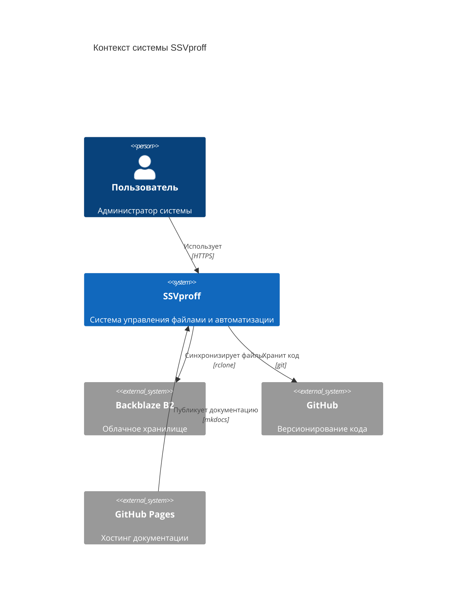
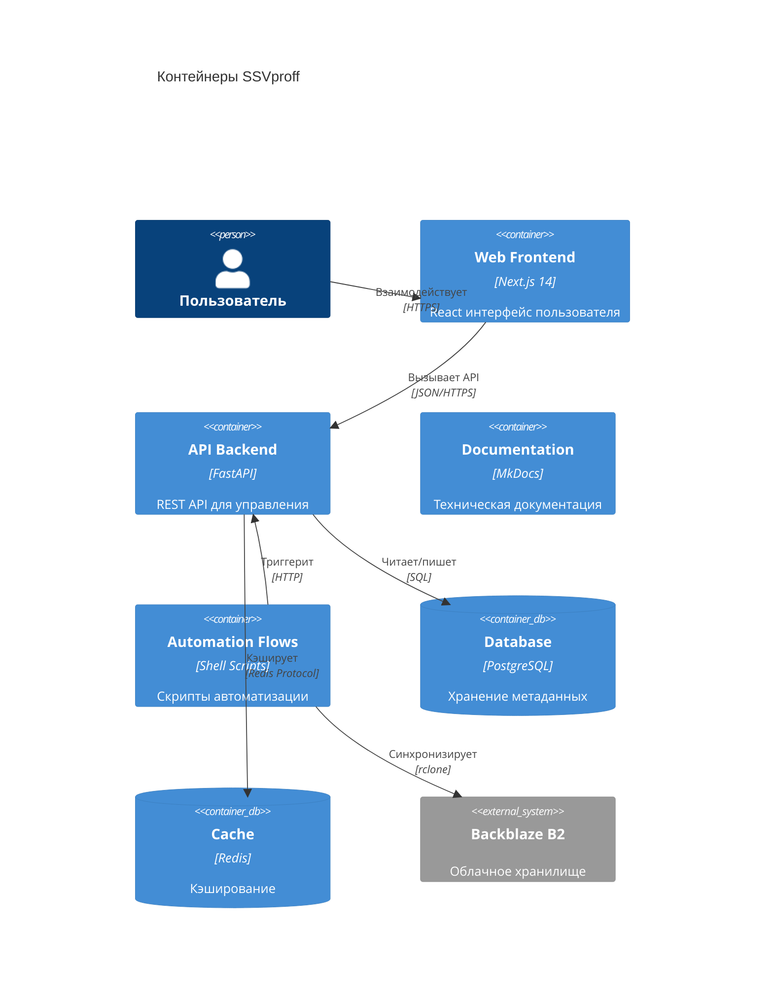
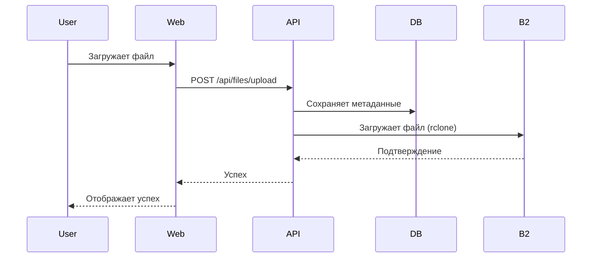
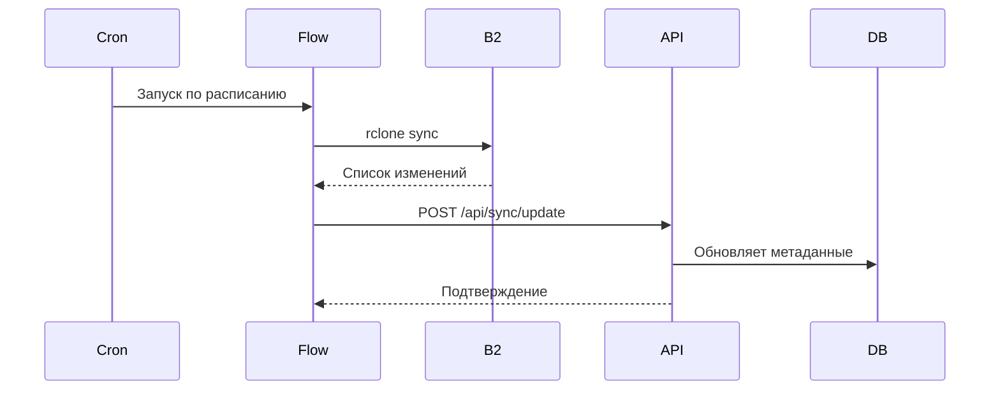

# Архитектура проекта SSVproff

## Обзор

SSVproff — это монорепозиторий для управления файлами, автоматизации процессов, обеспечения безопасности и версионирования данных.

## Диаграмма C4: Контекст системы



## Диаграмма C4: Контейнеры



## Компоненты

### 1. API Backend (`/api`)

**Технологии:**
- Python 3.11+
- FastAPI 0.115+
- SQLAlchemy 2.0 (ORM)
- PostgreSQL (база данных)
- Redis (кэширование)

**Ответственности:**
- REST API для управления файлами
- Аутентификация и авторизация
- Бизнес-логика
- Интеграция с внешними сервисами

**Структура:**
```
api/
├── app/
│   ├── main.py           # Точка входа
│   ├── api/              # API endpoints
│   ├── core/             # Конфигурация, безопасность
│   ├── models/           # SQLAlchemy модели
│   ├── schemas/          # Pydantic схемы
│   ├── services/         # Бизнес-логика
│   └── db/               # Database utilities
├── tests/                # Тесты
├── Dockerfile            # Production образ
└── requirements.txt      # Зависимости
```

### 2. Web Frontend (`/web`)

**Технологии:**
- Node.js 20+
- Next.js 14
- React 18
- TypeScript 5

**Ответственности:**
- Пользовательский интерфейс
- Server-side rendering
- API интеграция
- State management

**Структура:**
```
web/
├── src/
│   ├── app/              # Next.js App Router
│   ├── components/       # React компоненты
│   ├── lib/              # Утилиты
│   ├── hooks/            # Custom hooks
│   └── styles/           # CSS/Tailwind
├── public/               # Статические файлы
└── package.json          # Зависимости
```

### 3. Automation Flows (`/flows`)

**Технологии:**
- Shell scripts
- rclone
- DVC (Data Version Control)

**Ответственности:**
- Автоматическая синхронизация файлов
- Backup и restore
- Data versioning
- Scheduled tasks

### 4. Documentation (`/docs`)

**Технологии:**
- MkDocs
- Material for MkDocs
- mike (версионирование)

**Ответственности:**
- Техническая документация
- API документация
- Руководства пользователя
- ADR (Architecture Decision Records)

## Потоки данных

### Upload Flow



### Sync Flow



## Безопасность

### Аутентификация и авторизация

- JWT токены для API
- OAuth 2.0 для сторонних интеграций
- Role-based access control (RBAC)

### Защита данных

- HTTPS everywhere
- Шифрование данных в покое (B2 encryption)
- Шифрование в transit (TLS 1.3)
- Secrets management через environment variables

### Security scanning

- Dependabot для обновления зависимостей
- CodeQL для статического анализа
- Trivy для сканирования уязвимостей
- pip-audit и npm audit

## Deployment

### Development

```bash
# Локальная разработка через Docker Compose
docker-compose up -d
```

### Production

- **API:** Контейнер на облачной платформе (Railway, Render, AWS)
- **Web:** Vercel или Netlify для Next.js
- **Docs:** GitHub Pages через GitHub Actions

## Мониторинг и логирование

### Логирование

- Структурированное логирование (structlog)
- Уровни: DEBUG, INFO, WARNING, ERROR
- Централизованный сбор логов

### Метрики

- Health checks для всех сервисов
- Performance metrics
- Error tracking

## Масштабирование

### Горизонтальное масштабирование

- API: stateless, легко масштабируется
- Web: edge functions и CDN
- Database: read replicas при необходимости

### Оптимизация производительности

- Redis кэширование
- Database indexing
- CDN для статических файлов
- Lazy loading для больших данных

## Связанные документы

- [ADR-0001: Выбор монорепо](adr/0001-monorepo-structure.md)
- [API Documentation](api/fastapi.md)
- [Deployment Guide](development/ci-cd.md)
